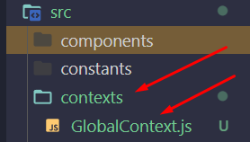

# React Context - Template de Aula

[ link do codesandbox](https://codesandbox.io/s/template-context-i4kjw1)

## Índice

-   [1. Configurações Iniciais](#1-configurações-iniciais)
-   [2. Prática 1](#prática-1)
-   [3. Prática 2](#prática-2)
-   [4. Prática 3](#prática-3)
-   [3. Fixação 2](#fixação)

## 1. Configurações Iniciais

## Prática 1

### Enunciado:

-   O primeiro passo é criar o nosso contexto:
    -   Criaremos a pasta `contexts` e dentro dela o arquivo chamado `GlobalContext.js`
    -   Dentro desse arquivo exportaremos nosso contexto criado

### Minha Resolução:

-   Em `src` criei a pasta `contexts` com o arquivo `GlobalContext.js`:
    

-   Em `GlobalContext.js`:

    ```
    import { createContext } from "react";

    const GlobalContext = createContext();

    export default GlobalContext;

    ```

## Prática 2

### Enunciado:

### Minha Resolução:

-   Em `App.js`

    -   Irei importar o meu contexto:

    ```
    import GlobalContext from "./contexts/GlobalContext";
    ```

    -   E chamar o meu contexto da seguinte form:

    ```
    <GlobalContext.Provider>
        <Router />
    </GlobalContext.Provider>
    ```

    -   Depois irei chamar a lógica que estava no Router para o `App.js`:

    ```
    import axios from "axios";
    import { useEffect, useState } from "react";
    import { BASE_URL } from "./constants/url";
    import GlobalContext from "./contexts/GlobalContext";
    import Router from "./routes/Router";

    export default function App() {
    const [pokelist, setPokelist] = useState([]);
    const [pokedex, setPokedex] = useState([]);

    useEffect(() => {
        fetchPokelist();
    }, []);

    const fetchPokelist = async () => {
        try {
        const response = await axios.get(BASE_URL);
        setPokelist(response.data.results);
        } catch (error) {
        console.log("Erro ao buscar lista de pokemons");
        console.log(error.response);
        }
    };

    const addToPokedex = (pokemonToAdd) => {
        const isAlreadyOnPokedex = pokedex.find(
        (pokemonInPokedex) => pokemonInPokedex.name === pokemonToAdd.name
        );

        if (!isAlreadyOnPokedex) {
        const newPokedex = [...pokedex, pokemonToAdd];
        setPokedex(newPokedex);
        }
    };

    const removeFromPokedex = (pokemonToRemove) => {
        const newPokedex = pokedex.filter(
        (pokemonInPokedex) => pokemonInPokedex.name !== pokemonToRemove.name
        );

        setPokedex(newPokedex);
    };
    return (
        <GlobalContext.Provider>
        <Router />
        </GlobalContext.Provider>
    );
    }

    ```

## Prática 3

### Enunciado:

### Minha Resolução:

-   No primeiro `Provider` irei passar todas as informações que eu vou utilizar dentro do `value`

-   Para ficar organizado eu crio uma variável para passar todas as informações

    ```
        const data = {
            removeFromPokedex,
            addToPokedex,
            fetchPokelist,
            pokedex,
            setPokedex,
            pokelist,
            setPokelist,
        };

        return (
            <GlobalContext.Provider value={data}>
                <Router />
            </GlobalContext.Provider>
        );
    ```

-   Em `HomePage` importa e chama o contexto:
-   Importando

    ```
    import { useContext } from 'react';
    import GlobalContext from '../../contexts/GlobalContext';
    ```

-   Chamando:

    ```
    const context = useContext(GlobalContext);
    // console.log(context);
    const { pokelist, addToPokedex, pokedex } = context;
    ```

-   Em `PokedexPage` importa e chama o contexto:

    -   Importa:

    ```
    import { useContext } from 'react';
    import GlobalContext from '../../contexts/GlobalContext';
    ```

    -   Chama:

    ```
    const context = useContext(GlobalContext);
    const { pokedex, removeFromPokedex } = context;
    ```

## Fixação

### Enunciado:

### Minha Resolução:
